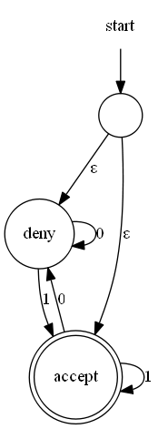
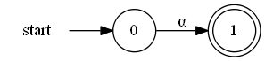
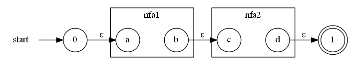
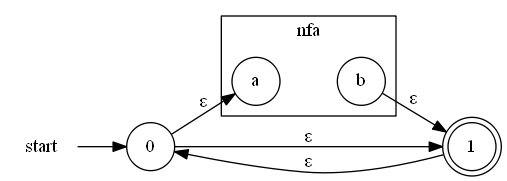
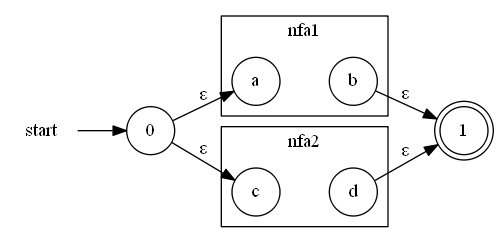
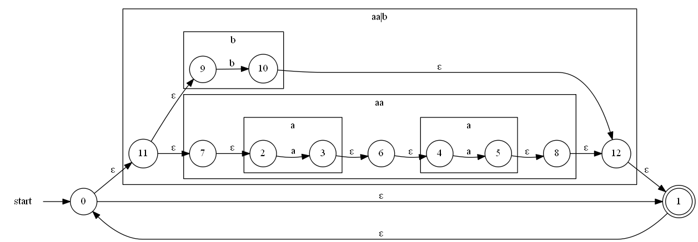
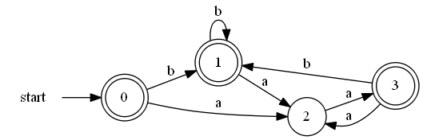
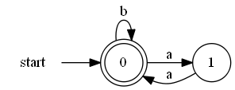

# Vacation! Let’s build a lexer!

## Problem

Given a set of regular expressions, determine the corresponding NFA (non-deterministic finite automaton)!

## What is my motivation?
Before I can parse a text, it first has do be translated into tokens. Tokens group the stream of input characters into usable chunks. Typical tokens are parentheses, identifiers, numbers or keywords. I desire to convert a stream of characters into a stream of tokens. This step is called lexical analysis. The executing automaton is called lexer. The class of language this automaton can handle are regular expressions.

## What are regular expressions?
They are classes of character sequences. Each class can be described using the following operators:

* Concatenation: `ab` (searching an `a` followed by a `b`)
* Repetition: `a*` = `a` or `aa` or `aaa`… (finite sequence)
* Alternation: `aa|bb` = `aa` or `bb`

Combinations of these operators are also possible, like `(0|1)+.(0|1)+` for binary decimal strings, like `0.0`, `1010.110`...

## And what is a NFA?
Basically it is a certain class of state machine. A deterministic finite automaton (DFA) starts at one state. Each state has `n` outgoing edges, where `n` is the number of distinct input symbols. Some states are marked as accepting states. If the state machine holds at an accepting state, a token could be emitted. Non-determinism just says that the edges could occur multiple times for one state or that no symbol must be read to change the state (&epsilon; transitions).

### Example



Circles represent state. Double cycles are accepting states. Transitions are labelled with input symbols. The input symbol `&epsilon;` is the `EMPTY` input (no character).

### The `IAutomaton` Interface

```csharp
public interface IAutomaton
{
  int StartState { get; }
  int StateCount { get; }
  ISet<int> AcceptingStates { get; }
  //source -> input symbol -> targets
  IReadOnlyDictionary<int, IReadOnlyDictionary<char, ISet<int>>> TransitionsBySource { get; }
}
```

## Solution
To convert a regular expression into a NFA, you just have to find an automaton representation for each construction rule (concatenation, repetition and alternation). Let’s do this!

### Single character



### Concatenation of two DFAs


### Repetition


### Alternation


### Big example
Here is an automaton for the regular expression `(aa|b)*`.


## But there are too many epsilon transitions…
We can eliminate them by **converting the NFA to an DFA**.

Instead of starting with the start state, we start with the epsilon closure of the start state. That are the states that are reachable via epsilon transition from the start. Each combination of NFA states (possibly `2^|states|`), stands for a DFA state.

For every input character we advance from one DFA state to the next, always expanding the NFA states with an epsilon closure to a set of states representing the resulting DFA state. By doing this we eliminate all epsilon transitions – isn’t that great?!

The advantage of an DFA is that we can run simulations faster. The disadvantage is the building time and its space. In worst case they could go up to `O(2^n)`, where `n` is the length of the regular expression.

### Big example continued...
By applying this natural language algorithm, we get the following automaton.



|DFA state| NFA states|
|---------|-----------|
|0        |{0, 1, 2, 7, 9, 11} |
|1        |{0, 1, 2, 7, 9, 10, 11, 12} |
|2        |{3, 4, 6} |
|3        |{0, 1, 2, 5, 7, 8, 9, 11, 12} |

## But is this automaton minimal?
Can we not reduce some states here!? The answer is yes.
The algorithm is quiet simple... but expensive (O(n^2), where n is the number of states). We are searching all equivalence classes of the given states. Two states are equal, if both are accepting or both are denying *and* all their transition’s target states for the same input are pairwise equal (recursion). You can start the recursion by distinguishing all denying from accepting states.

### Example

|Equal?|0 |1 |2 |
|------|--|--|--|
|**3** |e1|e1|no|
|**2** |no|no|- |
|**1** |e1|- |- |

We have found one equivalence class `e1`. So, at the end we can merge the three states `0`, `1`, `3` to a new DFA state `0` and `2` becomes `1`. This is the resulting DFA (quite small, huh?):



Great the automata resulting from a regular expression are complete and minimal. Now let’s construct the lexer!

## Finally: The lexer!

The task now is to transform a text with a set of regular expressions into ordered set of tokens. So, the trivial approach would be a for loop over the set of regular expressions until one does match. But this is boring. I will combine all regular expressions with the alternate operator `|`. All I need is a feedback which regular expression has matched and how far (when multiple expressions matches, tell me all of them).

```
xyz
```

## Further readings
*	[Alfred Aho et. al. – Compilers](https://www.amazon.com/Compilers-Principles-Techniques-Tools-2nd/dp/0321486811)
*	[Github repository](https://github.com/Lotes/how-to-build-a-lexer)
* [GraphViz](https://www.graphviz.org/) used for generating diagrams

## TODO
* show some interfaces... (code)
